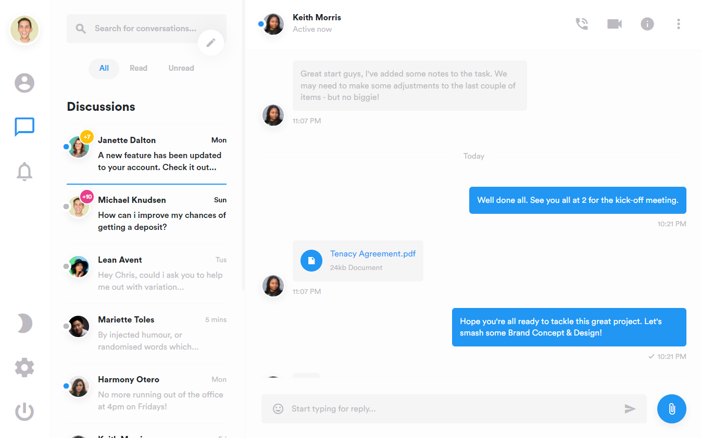

## Medau - Social Platform
A full social networking platform with real-time chat messenger
and video chat option, this is my current project.
Still many functionalities are not ready yet.

This is what the site will look like when completed:



## Table of contents
* [General info](#general-info)
* [Technologies](#technologies)
* [Setup](#setup)

## General info

Ongoing..


## Technologies
Project is created with:
* 
* 

	
## Setup

Please download the appropriate environment and read the instructions for installing it
* [Python](https://www.python.org/downloads/)
* [Django](https://docs.djangoproject.com/en/3.2/topics/install/)

Install Git
* [GIT](https://git-scm.com/book/en/v2/Getting-Started-Installing-Git)

To clone respiratory from github:
```
$ git clone https://github.com/aemiks/Medau.git

```
When the cloning is successful, and if you are in the project main folder:
```
$ pip install -r requirements.txt

```

To launch project:
```
$ python manage.py runserver

```

enjoy.
